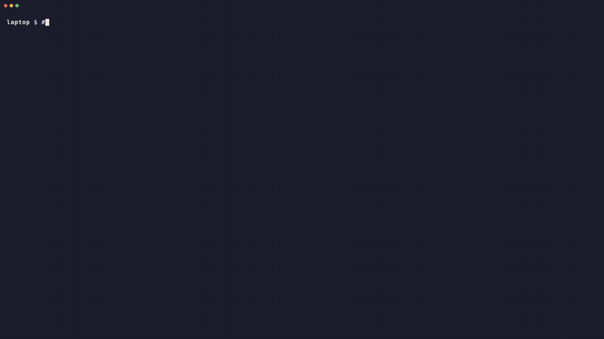

# agent-handoff

[](https://github.com/shanev/agent-handoff/actions/workflows/test.yml)

Move a running coding-agent session to another machine and keep going there.



<sub>A real handoff from a laptop to a Mac mini, with the waits cut. [MP4 version](docs/agent-handoff-demo.mp4)</sub>

Say you're working with Claude Code on your laptop and want the session to keep running on the Mac mini at home, or you're at the mini and want the laptop's session over here. Ask your agent to hand it off. It quits the agent, moves the conversation, the branch and your uncommitted changes, and resumes the same session in [herdr](https://herdr.dev) on the other machine. The repo can live at a different path there; it's matched by its git remote.

- **Sessions it can move:** Claude Code, Codex, omp, pi and grok.
- **Agents that can do the moving:** any agent that supports [skills](https://skills.sh), such as Hermes, Claude Code, Codex, OpenClaw or pi. Supported agents can also move their own session after their current turn ends.

## Using it

Once the skill is installed, tell your agent what you want:

> Hand off my hark Claude session to vega.

> Move the codex agent in modelrelay over to the mini.

> Bring the session that's running on vega back to my laptop.

> Move my hark Claude session into its own worktree.

> Move yourself to vega once this turn ends.

> What agents could I hand off right now?

> Is vega set up for handoffs?

Your agent finds the session you mean and checks the other machine. If anything is unclear, it asks: which agent, which machine, or which checkout when there's more than one. Then it moves the session and tells you where it ended up:

> Moved **hark-claude** to vega. It's running in `/Users/vega/github.com/tensor-systems/hark` on `main`, with your two uncommitted files. Attach with `herdr --remote vega@vega`.

Attach from wherever you are and carry on. The agent remembers the whole conversation. To bring it back, ask again, from either machine.

When you ask an agent to move itself, it checks the target and opens a helper pane, then finishes its reply. The helper starts the move as soon as the agent goes idle, including its final reply and any edits from that turn. It waits up to 30 minutes by default; `--wait-timeout SECONDS` changes this maximum. The helper closes on success and stays open with the error on failure. If the wait times out, the source agent keeps running.

A few things you might notice afterwards:

- **Your laptop's checkout is clean.** The uncommitted changes went with the session, and the local copy is stashed. `git stash list` shows it, labelled `agent-handoff`.
- **The agent may ask about trust on the other machine.** If it asks to trust the folder, the handoff answers yes, since you were already working in that repo. Pass `--no-trust` if you'd rather answer it yourself. Codex may also ask you to approve the herdr hook the handoff installed; that one is always left to you, and your agent will say so.
- **The original pane stays open** at a shell prompt.

### On the same machine

Handoffs work without a second machine, too. "Move my hark Claude session into its own worktree" moves the session, with its uncommitted changes, into a new worktree of the repo on a `handoff/<id>` branch, which frees the original checkout. "Move it to my other checkout" moves it into another clone you name. There's no SSH involved; everything else works the same.

## Install

On every machine you want to hand sessions **from** (usually all of them), with [skills.sh](https://skills.sh)'s installer:

```bash
npx skills add shanev/agent-handoff -g
```

It asks which of your agents to install it for (`-a claude-code codex` and so on to choose up front). With Hermes, you can also use its own installer:

```bash
hermes skills install shanev/agent-handoff/skills/agent-handoff
```

Then ask your agent "is `<machine>` set up for agent handoffs?" to check each machine you'll hand sessions **to**.

**Agents that sandbox commands.** The handoff needs the network (ssh) and writes to other agents' session folders. Codex's default sandbox blocks both, so Codex asks you to approve running the handoff script outside it; approve those requests. If Codex is set never to ask (`--ask-for-approval never`), it can't run handoffs to other machines.

## Requirements

On both machines:

- [herdr](https://herdr.dev) 0.8.0 or newer, with its server running, and the agents running inside herdr panes.
- `python3` 3.9 or newer, plus `git`, `ssh` and `tar`. Stock macOS has all of these.
- The agent's CLI (`claude`, `codex`, `omp`, `pi` or `grok`), installed, logged in, and on the PATH of interactive shells, since herdr starts it in a pane. Installers that put it in `~/.local/bin` don't always add that to the PATH; check `~/.bashrc`. If an agent was never set up or isn't logged in on the other machine, the handoff still copies the session, and your agent tells you to finish setup there.
- A clone of the repo, with a git remote so it can be matched.

Between them:

- SSH that works without prompts, in both directions if you want to hand sessions back. Check with `ssh -o BatchMode=yes <host> true`. Tailscale works well for this. Tailscale SSH in *check mode* asks you to re-authenticate in a browser from time to time; until you do, handoffs to that machine fail with an ssh error. To bring a session back, the other machine reaches this one as `you@this-hostname`; if that's not the right name, set `AGENT_HANDOFF_SELF=user@host`. The skill never sets up ssh for you; if it's missing, your agent tells you what to fix.

On the machine you hand off from, install herdr's integration for your agent (`herdr integration install claude`, and so on) so herdr records session ids. It isn't strictly needed: without it, the handoff falls back to the agent's newest transcript for that folder. On the receiving machine, the handoff installs the integration itself if it's missing.

## What a handoff does

1. Finds the agent and its session in herdr.
2. Finds the same repo on the other machine by git remote. It searches `~/github.com`, `~/src`, `~/code`, `~/dev`, `~/Developer`, `~/projects`, `~/repos`, `~/work`, `~/git`, `~/workspace` and the top of `~`. To change that, set `AGENT_HANDOFF_ROOTS=dir1:dir2` on that machine.
3. Quits the agent so its transcript is final.
4. Sends your commits and a snapshot of uncommitted and untracked files **directly to the other machine over SSH**. Nothing is pushed to GitHub, and no branch is force-updated.
5. Fast-forwards the branch where it's checked out on the other machine, or creates a worktree at `<repo>.worktrees/<branch>`, then applies your changes.
6. Copies the transcript into the agent's session folder there (honouring `CLAUDE_CONFIG_DIR`, `CODEX_HOME`, `PI_CODING_AGENT_DIR` and `GROK_HOME`) and rewrites the old paths inside it.
7. Opens a herdr workspace there and resumes the session.
8. Stashes the changes on the machine it left.

If anything goes wrong once the agent has quit, including the agent failing to start on the other side, the agent is restarted where it was and you're told why.

## Running it yourself

The skill is a single script, so you can also run it directly:

```bash
S=~/.agents/skills/agent-handoff/scripts/agent_handoff.py   # skills.sh install; Hermes: ~/.hermes/skills/agent-handoff/...
python3 $S list                                  # agents here
python3 $S doctor vega@vega                      # check both machines
python3 $S send hark-claude vega@vega --dry-run  # show the plan
python3 $S send hark-claude vega@vega            # do it
python3 $S send hark-claude vega@vega --self     # from inside that agent: defer until idle
python3 $S send hark-claude vega@vega --self --wait-timeout 60  # wait at most one minute
python3 $S send hark-claude --from vega@vega     # bring one back from vega
python3 $S send hark-claude --here --new-worktree  # same machine, into a new worktree
```

Run `python3 $S send --help` for every option.

## Tested on

- **macOS ⇄ macOS:** Claude Code 2.1 and Codex 0.160, between a MacBook and a Mac mini over Tailscale.
- **macOS ⇄ Linux:** Claude Code, between a MacBook and an Ubuntu 24.04 server (x86_64, root, bash) over Tailscale SSH.
- **One machine:** omp, pi 0.84 and grok 1.0.46 between two checkouts, plus the `--here` modes.
- **Self-handoff:** Claude Code 2.1.293 on macOS between two disposable checkouts, including timeout, final-turn edits and conversation continuity, helper cleanup, and source restart after a dirty-target failure.
- **Agents doing the moving:** Hermes, Claude Code and Codex, each asked in plain words with the skill installed and nothing else said about it. Codex asked for approval to run the script outside its sandbox, as described above.

All of it with herdr 0.8.0 and 0.9.3, and zsh/bash/sh. CI runs the tests on Linux and macOS. Reports from other setups are welcome.

## Adding an agent

Each agent is a small adapter class in [`agent_handoff.py`](skills/agent-handoff/scripts/agent_handoff.py). It says where the transcript lives, where it goes on the other machine, how to resume it, and what its "trust this folder?" screen looks like. PRs for more agents are welcome.

## Running the tests

```bash
python3 -m unittest discover -s tests -v
```

Stdlib only, no installs needed. The tests cover remote matching, session paths, repo discovery and the trust-screen logic, and they run the git handoff steps against real temporary repos. CI runs them on Linux and macOS with Python 3.9 and 3.13.

## License

MIT
